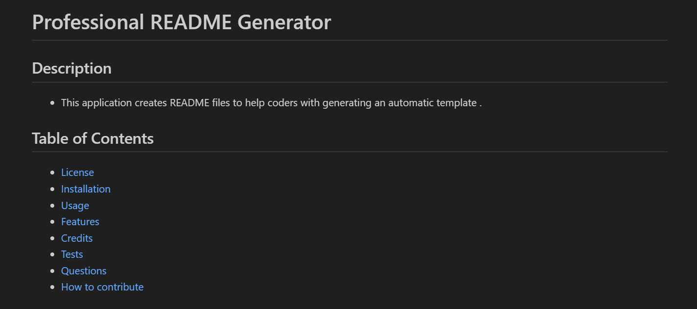

# Professional README Generator

  ## Description
  - This is an application used to create README files so a user does not have to make one from scratch.

  ## Table of Contents

  - [License](#license)
  - [Installation](#installation)
  - [Usage](#usage)
  - [Features](#features)
  - [Credits](#credits)
  - [Tests](#test)
  - [Questions](#questions)
  - [How to contribute](#contribution)
  
  ## License
  
  - ](https://opensource.org/licenses/MIT)

  ## Installation
  
  To Install this application, please follow the steps below:
  - Copy from github and clone repo

  ## Usage

  

  - This application is used to speed up the process of creating README files for github users.

  ## Features

  - This project features inquirer version 8.2.4

  ## Credits

  - Devin Belle was the sole contributor. Devin created the application.

  ## Tests

  - A user will need to use node js to test this project as well as inquirer installed.

  ## Questions

  - Please contact through email or github

  Email: dbelle722@gmail.com
  Github: [devbelle](https://github.com/devbelle)

  ## How to Contribute

  - Please reach out to ask questions or let me know what could be improved

